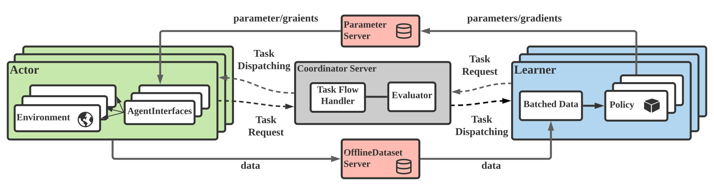

<div align=center style="margin-bottom: 20px"></div>


# MALib: A parallel framework for population-based multi-agent reinforcement learning

[](https://github.com/sjtu-marl/malib/blob/main/LICENSE)
[](https://malib.readthedocs.io/en/latest/?badge=latest)

MALib is a parallel framework of population-based learning nested with (multi-agent) reinforcement learning (RL) methods, such as Policy Space Response Oracle, Self-Play and Neural Fictitous Self-Play. MALib provides higher-level abstractions of MARL training paradigms, which enables efficient code reuse and flexible deployments on different distributed computing paradigms. The design of MALib also strives to promto the research of other multi-agent learning, including multi-agent imitation learning and model-based MARL.



## Installation

The installation of MALib is very easy. We've tested MALib on Python 3.6 and 3.7. This guide is based on ubuntu 18.04 and above. We strongly recommend using [conda](https://docs.conda.io/en/latest/miniconda.html) to manage your dependencies, and avoid version conflicts. Here we show the example of building python 3.7 based conda environment.


```bash
conda create -n malib python==3.7 -y
conda activate malib

# install dependencies
./install_deps.sh

# install malib
pip install -e .
```

External environments are integrated in MALib, such as StarCraftII and vizdoom, you can install them via `pip install -e .[envs]`. For users who wanna contribute to our repository, run `pip install -e .[dev]` to complete the development dependencies.

**optional**: if you wanna use alpha-rank to solve meta-game, install open-spiel with its [installation guides](https://github.com/deepmind/open_spiel)

## Quick Start

```python
"""PSRO with PPO for Leduc Holdem"""

from malib.envs.poker import poker_aec_env as leduc_holdem
from malib.runner import run
from malib.rollout import rollout_func


env = leduc_holdem.env(fixed_player=True)

run(
    agent_mapping_func=lambda agent_id: agent_id,
    env_description={
        "creator": leduc_holdem.env,
        "config": {"fixed_player": True},
        "id": "leduc_holdem",
        "possible_agents": env.possible_agents,
    },
    training={
        "interface": {
            "type": "independent",
            "observation_spaces": env.observation_spaces,
            "action_spaces": env.action_spaces
        },
    },
    algorithms={
        "PSRO_PPO": {
            "name": "PPO",
            "custom_config": {
                "gamma": 1.0,
                "eps_min": 0,
                "eps_max": 1.0,
                "eps_decay": 100,
            },
        }
    },
    rollout={
        "type": "async",
        "stopper": "simple_rollout",
        "callback": rollout_func.sequential
    }
)
```

## Documentation

See [MALib Docs](https://malib.readthedocs.io/)

## Citing MALib


If you use MALib in your work, please cite the accompanying [paper](https://yingwen.io/malib.pdf).

```bibtex
@misc{zhou2021malib,
      title={MALib: A Parallel Framework for Population-based Multi-agent Reinforcement Learning}, 
      author={Ming Zhou and Ziyu Wan and Hanjing Wang and Muning Wen and Runzhe Wu and Ying Wen and Yaodong Yang and Weinan Zhang and Jun Wang},
      year={2021},
      eprint={2106.07551},
      archivePrefix={arXiv},
      primaryClass={cs.MA}
}
```