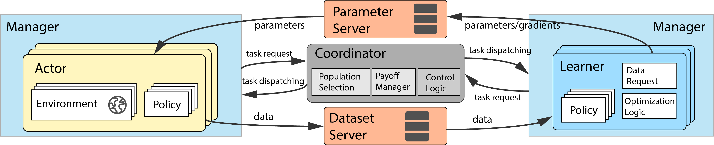

<div align=center></div>


# MALib: A parallel framework for population-based reinforcement learning

[](https://github.com/sjtu-marl/malib/blob/main/LICENSE)
[](https://malib.readthedocs.io/en/latest/?badge=latest)
[](https://app.travis-ci.com/sjtu-marl/malib.svg?branch=main)
[](https://codecov.io/gh/sjtu-marl/malib)

MALib is a parallel framework of population-based learning nested with reinforcement learning methods, such as Policy Space Response Oracle, Self-Play, and Neural Fictitious Self-Play. MALib provides higher-level abstractions of MARL training paradigms, which enables efficient code reuse and flexible deployments on different distributed computing paradigms.



## Installation

The installation of MALib is very easy. We've tested MALib on Python 3.8 and above. This guide is based on Ubuntu 18.04 and above (currently, MALib can only run on Linux system). We strongly recommend using [conda](https://docs.conda.io/en/latest/miniconda.html) to manage your dependencies, and avoid version conflicts. Here we show the example of building python 3.8 based conda environment.


```bash
conda create -n malib python==3.8 -y
conda activate malib

# install dependencies
./install.sh
```

## Environments

MALib integrates many popular reinforcement learning environments, we list some of them as follows.

- [x] [OpenSpiel](https://github.com/deepmind/open_spiel): A framework for Reinforcement Learning in games, it provides plenty of environments for the research of game theory.
- [x] [Gym](https://github.com/openai/gym): An open source environment collections for developing and comparing reinforcement learning algorithms.
- [x] [Google Research Football](https://github.com/google-research/football): RL environment based on open-source game Gameplay Football.
- [x] [SMAC](https://github.com/oxwhirl/smac): An environment for research in the field of collaborative multi-agent reinforcement learning (MARL) based on Blizzard's StarCraft II RTS game.
- [x] [PettingZoo](https://github.com/Farama-Foundation/PettingZoo): A Python library for conducting research in multi-agent reinforcement learning, akin to a multi-agent version of [Gymnasium](https://github.com/Farama-Foundation/Gymnasium).
- [ ] [DexterousHands](https://github.com/PKU-MARL/DexterousHands): An environment collection of bimanual dexterous manipulations tasks.

See [malib/envs](/malib/envs/) for more details. In addition, users can customize environments with MALib's environment interfaces. Please refer to our documentation.

## Algorithms and Scenarios

MALib integrates population-based reinforcement learning, popular deep reinforcement learning algorithms. See algorithms table [here](/algorithms.md). The supported learning scenarios are listed as follow:

- [x] Single-stream PSRO scenario: for single-stream population-based reinforcement learning algorithms, cooperating with empirical game theoretical analysis methods. See [scenarios/psro_scenario.py](/malib/scenarios/psro_scenario.py)
- [ ] Multi-stream PSRO scenario: for multi-stream population-based reinforcement learning algorithms, cooperating with empirical game theoretical analysis methods. See [scenarios/p2sro_scenario.py](/malib/scenarios/p2sro_scenario.py)
- [x] Multi-agent Reinforcement Learning scenario: for multi-/single-agent reinforcement learning, with distributed techniques. See [scenarios/marl_scenario.py](/malib/scenarios/marl_scenario.py)

## Quick Start

Before running examples, please ensure that you import python path as:

```bash
cd malib

# if you run malib installation with `pip install -e .`, you can ignore the path export
export PYTHONPATH=./
```

- Running PSRO example to start training for Kuhn Poker game: `python examples/run_psro.py`
- Running RL example to start training for CartPole-v1 game: `python examples/run_gym.py`

## Documentation

See online documentation at [MALib Docs](https://malib.readthedocs.io/), or you can also compile a local version by compiling local files as

```bash
pip install -e .[dev]
make docs-compile
```

Then start a web server to get the docs:

```bash
# execute following command, then the server will start at: http://localhost:8000
make docs-view
```

## Contributing

Read [CONTRIBUTING.md](/CONTRIBUTING.md) for more details.

## Citing MALib


If you use MALib in your work, please cite the accompanying [paper](https://www.jmlr.org/papers/v24/22-0169.html).

```bibtex
@article{JMLR:v24:22-0169,
  author  = {Ming Zhou and Ziyu Wan and Hanjing Wang and Muning Wen and Runzhe Wu and Ying Wen and Yaodong Yang and Yong Yu and Jun Wang and Weinan Zhang},
  title   = {MALib: A Parallel Framework for Population-based Multi-agent Reinforcement Learning},
  journal = {Journal of Machine Learning Research},
  year    = {2023},
  volume  = {24},
  number  = {150},
  pages   = {1--12},
  url     = {http://jmlr.org/papers/v24/22-0169.html}
}
```
