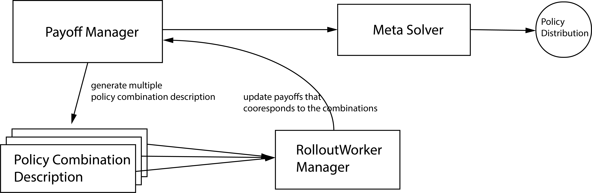

.. _concepts-doc:

.. role:: python(code)
  :language: python
  :class: highlight

Key Concepts
============

This page will help you to understand the workflow of MALib to train a population-based reinforcement learning algorithm. As for implementing such an algorithm instance, key components including ``Policy``, ``Evaluator``, ``RolloutWorkerManager`` and ``AgentInterfaceManager``. Functionally, the ``AgentInterfaceManager`` is responsible for a cluster of ``AgentInterface``, while the ``RolloutWorkerManager`` for a cluster of ``RolloutWorker``. The ``Policy`` is implemented as a behavior interface that packs models that parameterize an agent policy. As for the nested reinforcement learning algorithm, we depart it as a coordination of ``AgentInterfaceManager`` and ``RolloutWorkerManager``. We pack all of them as a scenario which isolates the details of components interaction.

    Overview of the interaction between Managers

Scenarios
---------

A scenario defines indicates a training instance, it brings all MALib components and the resource management together. Users can create their own scenario by inheriting the ``Scenario`` class, as we have implemented two standard scenarios under the :doc:`api/malib.scenarios`. To deploy a scenario as an instance, you only need to implement an scenario instance like ``PSROScenario``, then load it to the runner interface that locates under `malib.runner`. An example is listed as follow

.. code-block:: python

    from malib.runner import run
    from malib.scenarios.psro_scenario import PSROScenario

    scenario = PSROScenario(
        name=f"psro_{env_id}",
        log_dir=runtime_logdir,
        algorithms=algorithms,
        env_description=env_description,
        training_config=training_config,
        rollout_config=rollout_config,
        # control the outer loop.
        global_stopping_conditions={"max_iteration": 50},
        agent_mapping_func=agent_mapping_func,
        # for the training of best response.
        stopping_conditions={
            "training": {"max_iteration": int(1e4)},
            "rollout": {"max_iteration": 100},
        },
    )

    run(scenario)

Available Scenarios
^^^^^^^^^^^^^^^^^^^

* :ref:`marl-scenario-doc`

* :ref:`psro-scenario-doc`

* :ref:`league-training-doc`

Reinforcement Learning Algorithms
---------------------------------

MALib supports population-based learning algorithms that run nested reinforcement learning process. To better coordinate with the high-level population-based optimization, MALib devides traditional reinforcement learning algorithms into three key concepts, i.e., Policy, Trainer and AgentInterface.

Policy
^^^^^^

In a nutshell, policies are Python classes that define how an agent acts in an environment. Agents query the policy to determine actions. In an environment, there would be a multiple policies and some of them can be linked to multiple environment agents.

Currently, the implementation of policies is compatible with Tianshou library. However, for PyTorch implementation only. The customization of policies is very convenient for users, as we've abstract the policies into two mainstream implementation, i.e., value-based and policy-gradient-based. For example, the implementation of A2C could be:

.. code-block:: python

    class A2CPolicy(PGPolicy):
        def __init__(
            self,
            observation_space: spaces.Space,
            action_space: spaces.Space,
            model_config: Dict[str, Any],
            custom_config: Dict[str, Any],
            **kwargs
        ):
            super().__init__(
                observation_space, action_space, model_config, custom_config, **kwargs
            )

            preprocess_net: nn.Module = self.actor.preprocess
            if isinstance(action_space, spaces.Discrete):
                self.critic = discrete.Critic(
                    preprocess_net=preprocess_net,
                    hidden_sizes=model_config["hidden_sizes"],
                    device=self.device,
                )
            elif isinstance(action_space, spaces.Box):
                self.critic = continuous.Critic(
                    preprocess_net=preprocess_net,
                    hidden_sizes=model_config["hidden_sizes"],
                    device=self.device,
                )
            else:
                raise TypeError(
                    "Unexpected action space type: {}".format(type(action_space))
                )

            self.register_state(self.critic, "critic")

        def value_function(self, observation: torch.Tensor, evaluate: bool, **kwargs):
            """Compute values of critic."""

            with torch.no_grad():
                values, _ = self.critic(observation)
            return values.cpu().numpy()

Trainer
^^^^^^^

A ``Trainer`` defines the loss computation and specific training logics for a policy, users can load a policy instance and training configuration to peform training.

.. code-block:: python

    from mailb.rl.dqn import DQNTrainer, DEFAULT_CONFIG

    trainer = DQNTrainer(
        training_config=DEFAULT_CONFIG["training_config"],
        policy_instance=policy
    )

    loss = trainer(buffer=Batch(**data))

See :doc:`api/malib.rl.common` to get more details about the customization of trainer.

AgentInterface
^^^^^^^^^^^^^^

Conceptually, an ``AgentInterface`` manages a policy pool and its dependencies. Most importantly, schedule policy training according to the current policy combination. ``AgentInterface`` does not execute the specific training logic but pulls training data from the remote dataset server and syncs up policy parameters with the remote parameter server. It can also implement different training paradigms and distributed strategies. See :ref:`distributed-strategies-doc` to get more details.

    Overview of the interaction between Managers

AgentInterface Management
^^^^^^^^^^^^^^^^^^^^^^^^^

In the case of population-based and multi-agent learning, the basic management unit would be a policy pool, and there would be a training interface that is responsible for the training or evolution of each of them. As we observed, in most existing population-based RL algorithms,  the training of each agent is often isolated, i.e., no interaction between the populations in the training stage. The management of training policies is implemented as :python:`TrainingManager` in :doc:`api/malib.agent`. In multi-agent cases, there would be multiple simultaneous training job for the agents. As we've introduced the mechanism of :python:`RolloutWorkerManger` in previous section, each :python:`AgentInterface` has at least one :python:`RolloutWorker`.

Rollout Management
------------------

The management of rollout workers is implemented as :python:`RolloutWorkerManger` in :doc:`api/malib.rollout`. As the training cases involve multiple agents, MALib creates independent rollout workers for each training agent to achieve as much efficiency as possible. Each :python:`RolloutWorker` encapsulates an actor pool that contains multiople inference CS instance(s).

    Overview of the interaction between Managers

Rollout Worker
^^^^^^^^^^^^^^

A rollout worker is responsible for the specific simulation tasks that disttributed from the higher controller. As the simulation tasks could be heterogenous on the policy combination and behavior (e.g., exploration mode for training data collection, and exploit mode for policy evaluation), an :python:`RolloutWorker` creates an actor pool that considers both requirements of evaluation and data collection.

.. code-block:: python

    actor_pool = ActorPool(
        [
            self.inference_client_cls.remote(
                env_desc,
                ray.get_actor(settings.OFFLINE_DATASET_ACTOR),
                max_env_num=num_env_per_thread,
                use_subproc_env=rollout_config["use_subproc_env"],
                batch_mode=rollout_config["batch_mode"],
                postprocessor_types=rollout_config["postprocessor_types"],
                training_agent_mapping=agent_mapping_func,
            )
            for _ in range(num_threads + num_eval_threads)
        ]
    )

Furthermore, as the number of episodes for evaluation or data collection could be large, then a single-thread environment simulation would cause many waiting fragments that harm the simulation performance overall. The **environment vectorization** technique is considered in the implementation of :python:`RolloutWorker`, more details can be found in the :ref:`environments-doc` section. There are two kinds of policy use strategies for the interaction between polcies and environments, i.e., shared policy servers or independent copies of policies. MALib considers both of them in the implementation of :python:`RolloutWorker`. See :ref:`rollout-doc` for more details.

Population Evaluation
---------------------

The population evaluation is performed after some rounds of training, it is built upon the policy combination evlauation and :ref:`meta-solvers-doc` (for computing policy distribution over a population). To evaluation a given population, there would be many of policy combinations given by a :ref:`payoff-manager-doc`. 

    Overview of population evaluation