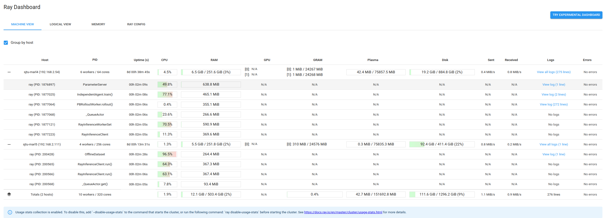

.. _deployment-doc:

Clustered Deployment
====================

This page introduce the method to set up and deploy your training on a Ray cluster. We provide a manually way to do that. Users can also refer the documentation on `ray-project <https://docs.ray.io/en/latest/cluster/getting-started.html>`_ to get other ways such as kubernates deployment.

.. note::

    Please make sure you have installed the MALib on machines that you will use as cluster nodes, and the project path should be the same for all of them.

This section assumes that you have a list of machines and that the nodes in the cluster share the same network. It also assumes that Ray is installed on each machine. You can use pip to install the ray command line tool with cluster launcher support. Follow the Ray installation instructions for more details.

Start the Head Node
-------------------

Choose any node to be the head node and run the following. If the ``--port`` argument is omitted, Ray will first choose port 6379, and then fall back to a random port if in 6379 is in use.

.. code-block:: shell

    # start head of ray cluster at 6379, and the monitor at 8265
    ray start --head --port=6379 --dashboard-port=8265

The command will print out the Ray cluster address, which can be passed to ray start on other machines to start the worker nodes (see below). If you receive a ConnectionError, check your firewall settings and network configuration.

Start Worker Nodes
------------------

Then on each of the other nodes, run the following command to connect to the head node you just created.

.. code-block:: shell

    ray start --address=<head-node-address:port>

Make sure to replace ``head-node-address:port`` with the value printed by the command on the head node (it should look something like 123.45.67.89:6379).

Note that if your compute nodes are on their own subnetwork with Network Address Translation, the address printed by the head node will not work if connecting from a machine outside that subnetwork. You will need to use a head node address reachable from the remote machine. If the head node has a domain address like compute04.berkeley.edu, you can simply use that in place of an IP address and rely on DNS.

Ray auto-detects the resources (e.g., CPU) available on each node, but you can also manually override this by passing custom resources to the ``ray start`` command. For example, if you wish to specify that a machine has 10 CPUs and 1 GPU available for use by Ray, you can do this with the flags ``--num-cpus=10`` and ``--num-gpus=1``. See the Configuration page for more information.

Check your running task return the cluster resources info as correct as display two nodes here:

.. code-block:: plain

    [2022-11-19 19:46:24,060][INFO] (runner:81) Ray cluster resources info: {'memory': 361143336347.0, 'accelerator_type:G': 1.0, 'object_store_memory': 159061429861.0, 'node:192.168.2.111': 1.0, 'GPU': 3.0, 'CPU': 320.0, 'accelerator_type:RTX': 1.0, 'node:192.168.2.54': 1.0}

and then the running logs will be printed in the head node as follows:

.. code-block:: plain

    (PBRolloutWorker pid=1877064) [2022-11-19 19:47:17,211][INFO] (rolloutworker:458) Evaluation at epoch: 0
    (PBRolloutWorker pid=1877064) {'agent_reward/agent_max': 11.0,
    (PBRolloutWorker pid=1877064)  'agent_reward/agent_mean': 9.338095238095239,
    (PBRolloutWorker pid=1877064)  'agent_reward/agent_min': 5.0,
    (PBRolloutWorker pid=1877064)  'agent_step/agent_max': 11.0,
    (PBRolloutWorker pid=1877064)  'agent_step/agent_mean': 9.338095238095239,
    (PBRolloutWorker pid=1877064)  'agent_step/agent_min': 5.0,
    (PBRolloutWorker pid=1877064)  'env_step_max': 11,
    (PBRolloutWorker pid=1877064)  'env_step_mean': 9.338095238095239,
    (PBRolloutWorker pid=1877064)  'env_step_min': 5,
    (PBRolloutWorker pid=1877064)  'episode_reward_max': 11.0,
    (PBRolloutWorker pid=1877064)  'episode_reward_mean': 9.338095238095239,
    (PBRolloutWorker pid=1877064)  'episode_reward_min': 5.0,
    (PBRolloutWorker pid=1877064)  'performance': {'ave_rollout_FPS': 1131.3788088578215,
    (PBRolloutWorker pid=1877064)                  'rollout_FPS': 1131.3788088578215,
    (PBRolloutWorker pid=1877064)                  'rollout_iter_rate': 0.0327749285686886}}
    (PBRolloutWorker pid=1877064) [2022-11-19 19:47:23,134][INFO] (rolloutworker:458) Evaluation at epoch: 1
    (PBRolloutWorker pid=1877064) {'agent_reward/agent_max': 22.0,
    (PBRolloutWorker pid=1877064)  'agent_reward/agent_mean': 9.625615763546797,
    (PBRolloutWorker pid=1877064)  'agent_reward/agent_min': 2.0,
    (PBRolloutWorker pid=1877064)  'agent_step/agent_max': 22.0,
    (PBRolloutWorker pid=1877064)  'agent_step/agent_mean': 9.625615763546797,
    (PBRolloutWorker pid=1877064)  'agent_step/agent_min': 2.0,
    (PBRolloutWorker pid=1877064)  'env_step_max': 22,
    (PBRolloutWorker pid=1877064)  'env_step_mean': 9.625615763546797,
    (PBRolloutWorker pid=1877064)  'env_step_min': 2,
    (PBRolloutWorker pid=1877064)  'episode_reward_max': 22.0,
    (PBRolloutWorker pid=1877064)  'episode_reward_mean': 9.625615763546797,
    (PBRolloutWorker pid=1877064)  'episode_reward_min': 2.0,
    (PBRolloutWorker pid=1877064)  'performance': {'ave_rollout_FPS': 1414.794048720742,
    (PBRolloutWorker pid=1877064)                  'rollout_FPS': 1698.2092885836623,
    (PBRolloutWorker pid=1877064)                  'rollout_iter_rate': 0.05489372662924034}}

Dashboard
---------

As you've start a dashboard at port 8265, you can see the monitor resources as

    Ray cluster monitor