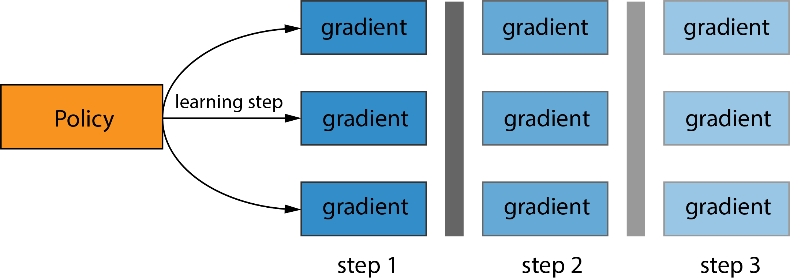
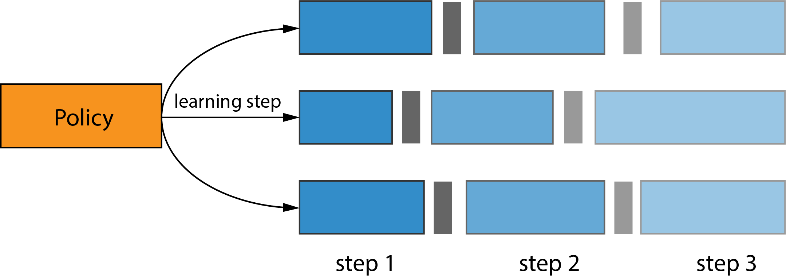
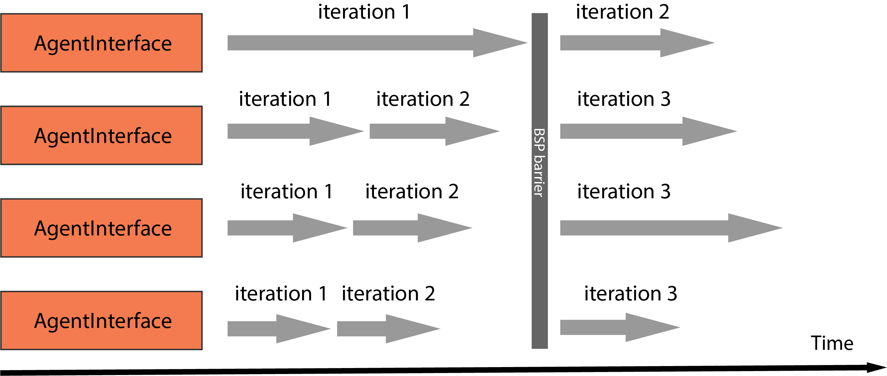

.. _distributed-strategies-doc:

Distributed Strategies
======================

MALib has included typical distributed strategies that have been applied in existing distributed reinforcement learning algorithms. As MALib departs the implementation of rollout and training, it can easily distribute different distributed strategies by calling different ``AgentInterface``.

AgentInterface is an esstential layer of abstraction in MALib's distributed architecture. Large-scale distributed training often requires expertise in tuning performance and convergence and thus users have to have strong backgrounds of both algorithms and distributed computing. As a trade-off between efficiency and flexibility, the high-level abstractions proposed by existing distributed RL frameworks either has limited scalability or fail to support more complicated training paradigm(e.g. population-based methods). With special focus on these issues, MALib introduces AgentInterface for fine-grained logic controlling and data communications. Logically, AgentInterface offers an unified interface of policy-data interaction for conventional RL and population-based training, while it can also be configured to be a local sink node managing parameter versions of sub-workers and offloading computation from the central node, offering efficient and highly-customizable interface for population-based training and large-scale training scenarios. MALib provides off-the-shelf implementations of AgentInterface convering several common distributed training paradigms.

Bulk Synchronous Parallel(BSP)
----------------------
Under the BSP mode, the sub-workers managed by an AgentInterface are initialized with the same copy of model parameters. In each iteration, sub-workers execute local gradients computation, followed by gradients submission to the Parameter Server(PS) and a global synchronous parameters update from PS. The PS will not pub the updated version of parameters until it has received and aggregated gradients from all of the sub-workers, which means during the whole training process all sub-workers of an AgentInterface has strictly the same version of model parameters. BSP naturally extends algorithms to the distributed scenarios but can suffer from synchronization overheads caused by the global synchronization barriers, especially when sub-workers have uneven computational speeds, which is also knowns as the struggler problem.

    
    Exmaple illustration of BSP

Asynchronous Parallel(ASP)
As opposite to the BSP mode, AgentInterface under ASP mode remove the synchronization barriers. All sub-workers submit local gradients to the PS, where gradients are applied to a globally shared copy of parameters, and pull the latest version of global parameters from the PS. ASP has better utilization of faster workers and less overheads due to asynchronous communication and parameter aggregration. However, ASP fails to offer theoretical guarantees of convergence.

    
    Exmaple illustration of ASP

Bounded Asynchronous Parallel(BAP)
---------------------
To alleviate the struggler problem in distributed computing while without being completely loss of synchronization, some machine learning algorithms adopts BAP model, which stands in the middle of the BSP and ASP models. The PS under BAP mode updates the global parameters only when it has received and aggregated all gradients from all sub-workers. Each sub-worker will check if a version of global parameters that is fresher than its local cache is available after submitting its local gradients generated from the previous iteration. The degree of staleness is defined as the difference in iteration numbers between the faster worker and the slowest worker. If fresher version of global parameters is ready for read, than sub-workers will pull the global parameters from the PS and update the local cache, while the stale copy of parameters from local cache(without updates from local gradients) is adopted if a newer version of global parameters is not available and the staleness of the sub-worker is less than the pre-defined staleness threshold S. Moreover, a threshold for longest living time of a single iteration is set, the violation of which will invoke an force interruption of ongoing iteration and a sync up, the result of iterrupted iteration(i.e. local gradients) will be ignored in the aggregation of certain iteration i. 

    Exmaple illustration of BAP.

