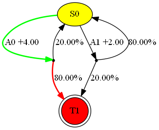

.. _environments-doc:

Environments
============

MALib implements a unified environment interface to satisfy both turn-based and simultaneous-based environments. MALib works with different environments, including simple Markov Decision Process environments, OpenAI-gym, OpenSpiel, and other user-defined environments under MALib's environment API. We first introduce the available environments supported by MALib and then give an example of how to customize your environments.

Available Environments
----------------------

This section introduce the environments have been integrated in MALib.

Simple Markov Decision Process
^^^^^^^^^^^^^^^^^^^^^^^^^^^^^^

mdp_ is a simple and easy-to-specify environment for standard Markov Decision Process. Users can create an instance as follows:

.. code-block:: python

    from malib.rollout.envs.mdp import MDPEnvironment, env_desc_gen

    env = MDPEnvironment(env_id="one_round_mdp")

    # or get environment description with `env_desc_gen`
    env_desc = env_desc_gen(env_id="one_round_mdp")
    # return an environment description as a dict:
    # {
    #     "creator": MDPEnvironment,
    #     "possible_agents": env.possible_agents,
    #     "action_spaces": env.action_spaces,
    #     "observation_spaces": env.observation_spaces,
    #     "config": {'env_id': env_id},
    # }

.. note::
    In MALib, this environment is used as a minimal testbed for verification of our algorithms' implementation. Users can use it for rapid algorithm validation.

..  _mdp: https://github.com/BlackHC/mdp

The available scenarios including:

* ``one_round_dmdp``: one-round deterministic MDP
* ``two_round_dmdp``: two-round deterministic MDP
* ``one_round_nmdp``: one-round stochastic MDP
* ``two_round_nmdp``: two-round stochastic MDP
* ``multi_round_nmdp``: multi-round stochastic MDP

    Illustration of a Multi-round stochastic MDP

If you want to customize a MDP, you can follow the guides in the `original repository <https://github.com/BlackHC/mdp>`_.

OpenAI-Gym
^^^^^^^^^^

Gym_ is an open-source Python library for developing and comparing reinforcement learning algorithms by providing a standard API to communicate between learning algorithms and environments and a standard set of environments compliant with that API. Since its release, Gym's API has become the field standard for doing this.

.. _Gym: https://github.com/openai/gym

.. code-block:: python

    from malib.rollout.envs.gym import GymEnv, env_desc_gen

    env = GymEnv(env_id="CartPole-v1", scenario_configs={})

    env_desc = env_desc_gen(env_id="CartPole-v1", scenarios_configs={})
    # return an environment description as a dict:
    # {
    #     "creator": GymEnv,
    #     "possible_agents": env.possible_agents,
    #     "action_spaces": env.action_spaces,
    #     "observation_spaces": env.observation_spaces,
    #     "config": config,
    # }

DeepMind OpenSpiel
^^^^^^^^^^^^^^^^^^

OpenSpiel_ is a collection of environments and algorithms for research in general reinforcement learning and search/planning in games. OpenSpiel supports n-player (single- and multi- agent) zero-sum, cooperative and general-sum, one-shot and sequential, strictly turn-taking and simultaneous-move, perfect and imperfect information games, as well as traditional multiagent environments such as (partially- and fully- observable) grid worlds and social dilemmas. OpenSpiel also includes tools to analyze learning dynamics and other common evaluation metrics. Games are represented as procedural extensive-form games, with some natural extensions. 

.. _OpenSpiel: https://github.com/deepmind/open_spiel

.. code-block:: python

    from malib.rollout.envs.open_spiel import OpenSpielEnv, env_desc_gen

    env = OpenSpielEnv(env_id="goofspiel")

    env_desc = env_des_gen(env_id="goofspiel")
    # return an environment description as a dict:
    # {
    #     "creator": OpenSpielEnv,
    #     "possible_agents": env.possible_agents,
    #     "action_spaces": env.action_spaces,
    #     "observation_spaces": env.observation_spaces,
    #     "config": config,
    # }

PettingZoo
^^^^^^^^^^

coming soon ...

SMAC: StarCraftII
^^^^^^^^^^^^^^^^^

coming soon ...

Google Research Football
^^^^^^^^^^^^^^^^^^^^^^^^

coming soon ...

Environment Customiztion
------------------------
MALib defines a specific class of ``Environment`` which is similar to ``gym.Env`` with some modifications to support multi-agent scenarios.

Customization
^^^^^^^^^^^^^

Interaction interfaces, e.g., ``step`` and ``reset``, take a dictionary as input/output type in the form of ``<AgentID, content>`` pairs to inform MALib of different agents' states and actions and rewards, etc. To imeplement a customized environment, some interfaces you must implement including

* ``Environment.possible_agents``: a property, returns a list of enviornment agent ids.
* ``Environment.observation_spaces``: a property, returns a dict of agent observation spaces.
* ``Environment.action_spaces``: a property, returns a dict of agent action spaces.
* ``Environment.time_step``: accept a dict of agent actions, main stepping logic function, you should implement the main loop here, then the ``Environment.step`` function will analyze its return and record time stepping information as follows:

    .. code-block:: python

        def step(
            self, actions: Dict[AgentID, Any]
        ) -> Tuple[
            Dict[AgentID, Any],
            Dict[AgentID, Any],
            Dict[AgentID, float],
            Dict[AgentID, bool],
            Any,
        ]:
            """Return a 5-tuple as (state, observation, reward, done, info). Each item is a dict maps from agent id to entity.

            Note:
                If state return of this environment is not activated, the return state would be None.

            Args:
                actions (Dict[AgentID, Any]): A dict of agent actions.

            Returns:
                Tuple[ Dict[AgentID, Any], Dict[AgentID, Any], Dict[AgentID, float], Dict[AgentID, bool], Any]: A tuple follows the order as (state, observation, reward, done, info).
            """

            self.cnt += 1
            rets = list(self.time_step(actions))
            rets[3]["__all__"] = self.env_done_check(rets[3])
            if rets[3]["__all__"]:
                rets[3] = {k: True for k in rets[3].keys()}
            rets = tuple(rets)
            self.record_episode_info_step(*rets)
            # state, obs, reward, done, info.
            return rets

MALib also supports `Wrapper` functionality and provides a `GroupWrapper` to map agent id to some group id.

Vectorization
^^^^^^^^^^^^^

MALib supports interacting with multiple environments in parallel with the implementation of auto-vectorized environment interface implemented in 'malib.rollout.env.vector_env'.

For users who want to use parallel rollout, he/she needs to modify certain contents in `rollout_config`.

.. code-block:: python

    rollout_config = {
        "fragment_length": 2000,  # every thread
        "max_step": 200,
        "num_eval_episodes": 10,
        "num_threads": 2,
        "num_env_per_thread": 10,
        "num_eval_threads": 1,
        "use_subproc_env": False,
        "batch_mode": "time_step",
        "postprocessor_types": ["defaults"],
        # every # rollout epoch run evaluation.
        "eval_interval": 1,
        "inference_server": "ray",  # three kinds of inference server: `local`, `pipe` and `ray`
    }
