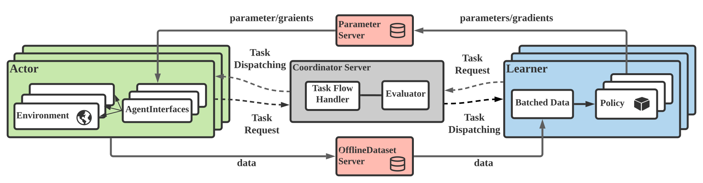

.. figure:: ../imgs/logo.svg
    :align: center
    :width: 45%

Introduction
============

MALib is a parallel framework of population-based learning nested with (multi-agent) reinforcement learning (RL) methods, such as Policy Space Response Oracle, Self-Play and Neural Fictitous Self-Play. MALib provides higher-level abstractions of MARL training paradigms, which enables efficient code reuse and flexible deployments on different distributed computing paradigms. The design of MALib also strives to promto the research of other multi-agent learning research, including multi-agent imitation learning and model-based RL.

    Overview of the MALib architecture.

Population-based MARL (PB-MARL)
^^^^^^^^^^^^^^^^^^^^^^^^^^^^^^^

In general, a PB-MARL algorithm will start from an initialized policy set and the distribution over the policies (**step 1**), then find new policies (**step 2**) via (MA)RL algorithms. After that, the policy set will be updated with new policies, also the policy distribution (**step 3**), and follow with (MA)RL tasks over expanded policy combinations (**step 4**). This process will be cyclically executed until meeting the convergence such as an estimated Nash Equilibrium, then output the final policy distribution.

.. figure:: ../imgs/pb_marl.svg
    :align: center

    The auto-curriculum learning paradigm of PB-MARL. 

The key features of MALib include:

* **Pytorch-based algorithm implementation**: All algorithms implemented in MALib are based on `PyTorch <https://pytorch.org/>`_.
* **Popular distributed computing RL framework support**: MALib support multiple distributed computing RL frameworks, including asynchronous  
* **Provide comprehensive multi-agent RL training interfaces**: MALib implemented abstractions of several popular MARL training paradigms, aims to accelerate the development of algorithms on, and make users focus on the development of core algorithms, not training flow customization. 

To get started, take a look over the :ref:`quick-start` and :ref:`api-doc`.

Citing MALib
^^^^^^^^^^^^

If you use MALib in your work, please cite the accompanying `paper <https://yingwen.io/malib.pdf>`_.

.. code-block:: bibtex

    @inproceedings{zhou2021malib,
        title={MALib: A Parallel Framework for Population-based Multi-agent Reinforcement Learning},
        author={Zhou, Ming and Wan, Ziyu and Wang, Hanjing and Wen, Muning and Wu, Runzhe and Wen, Ying and Yang, Yaodong and Zhang, Weinan and Wang, Jun},
        booktitle={Preprint},
        year={2021},
        organization={Preprint}
    }
