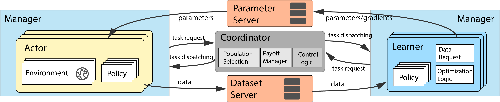

Introduction
============

MALib is a parallel framework for population-based learning methods including Policy Space Response Oracle, Self-Play, Neural Fictitious Self-Play, etc. which are nested with (multi-agent) reinforcement learning algorithms. MALib provides higher-level abstractions of MARL training paradigms, enabling efficient code reuse and flexible deployments on distributed strategies. The design of MALib also strives to promote the research of other multi-agent learning research, including multi-agent imitation learning and model-based RL.

    Overview of the MALib architecture.

Feature Overview
----------------

The key features of MALib are listed as follows:

* :ref:`concepts-doc`

* :ref:`marl-abstraction-doc`

* :ref:`distributed-strategies-doc`

* :ref:`environments-doc`

Citing MALib
------------

If you use MALib in your work, please cite the accompanying `paper <https://yingwen.io/malib.pdf>`_.

.. code-block:: bibtex

    @inproceedings{zhou2021malib,
        title={MALib: A Parallel Framework for Population-based Multi-agent Reinforcement Learning},
        author={Zhou, Ming and Wan, Ziyu and Wang, Hanjing and Wen, Muning and Wu, Runzhe and Wen, Ying and Yang, Yaodong and Zhang, Weinan and Wang, Jun},
        booktitle={Preprint},
        year={2021},
        organization={Preprint}
    }
