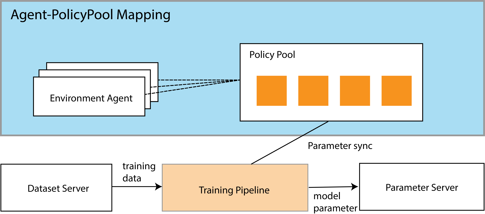
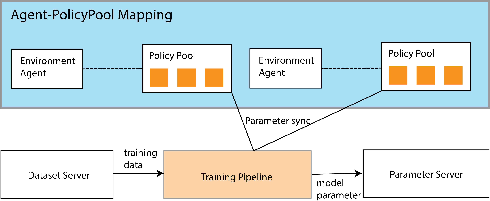
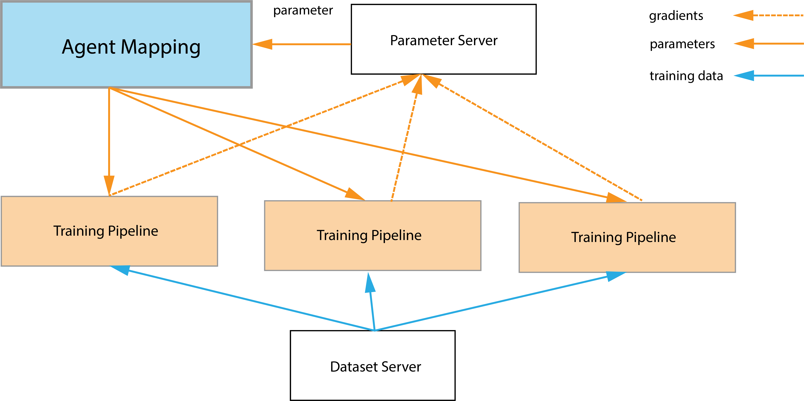

.. _marl-abstraction-doc:

.. role:: python(code)
  :language: python
  :class: highlight

MARL Training Paradigms
=======================

There are four kinds of training paradigms in the research of multi-agent reinforcement learning.

* **Independent Learning**: agents in an environment do not share policies, and no coordination between them, all of them optimize their own policies in an indenedent manner. Obviously, such a learning paradigm is also the learning paradigm for single-agent cases.

* **Centralized Training Decentralized Execution**: agents play their policies as single-agent cases, i.e., no coordination in the inference stage, but the training requires information from all of them, i.e., a shared critic or non-shared critics but share the information.

* **Fully Centrlized Learning**: agents are capsulated into a single policy/network, the training and inference behavior as a big **team agent**.

* **Networked (distributed) Learning**: this training paradigms is designed for some cases that involves hundreds of agents, in this case, the agent coordinate with only its neighbors (mathematically).

To cover the existing research in multi-agent reinforcement learning, we abstract the training paradigm as :python:`AgentInterface`. An AgentInterface is responsbile for the coordination between parameter server and dataset server, sometimes the other agent interfaces. To satisfy the requirements of population-based learning, an :python:`AgentInterface` also maintaines a policy population

Independent AgentInterface
^^^^^^^^^^^^^^^^^^^^^^^^^^

An :python:`IndependentAgent` is responsible for the training of an environment agent, or a shared group of agents. The coordination with parameter server and dataset server is unidirectional, as it only update the remote parameter version and pull training data from remote dataset server. See :doc:`api/malib.agent.indepdent_agent` for more details.

    Overview of the architecture of IndependentAgent

Team AgentInterface
^^^^^^^^^^^^^^^^^^^

An :python:`TeamAgent` is responsible for a group of agents that do not share a common policy pool. In this case, there would be multiple policy pools that are related to agents. And most importantly, there would be some coordination between them. For example, QMIX shares a common critic. See :doc:`api/malib.agent.indepdent_agent` for more details. The :python:`TeamAgent` supports both two training paradigms, i.e., Centralized Training Decentralized Execution and Fully-centralized Training.

    Overview of the architecture of IndependentAgent

Asynchronous AgentInterface
^^^^^^^^^^^^^^^^^^^^^^^^^^^

The :python:`AsynchronousAgent` is responsbile for the 

See :doc:`api/malib.agent.indepdent_agent`

    Overview of the architecture of IndependentAgent