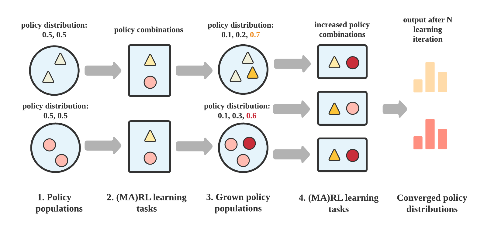

.. _quick-start:

.. role:: python(code)
  :language: python
  :class: highlight

.. role:: shell(code)
  :language: shell
  :class: highlight

Quick Start
===========

Follow this page to install your MALib and try an example training case.

Installation
------------

MALib has been tested on Python 3.7 and above. The system requirement is ubuntu18.04 or above. Windows is still not supported. 

Conda Environment
^^^^^^^^^^^^^^^^^

We strongly recommend using `conda <https://docs.conda.io/en/latest/miniconda.html>`_ to manage your dependencies, and avoid version conflicts. Here we show the example of building python 3.7 based conda environment.

.. code-block:: shell

    conda create -n malib python==3.7 -y
    conda activate malib

    # install dependencies
    cmake --version # must be >=3.12
    clang++ --version   # must be >=7.0.0
    sudo apt-get install graphviz cmake clang

    # install malib
    pip install -e .

Setup Development Environment
^^^^^^^^^^^^^^^^^^^^^^^^^^^^^

For users who wanna contribute to our repository, run ``pip install -e .[dev]`` to complete the development dependencies, also refer to the section :ref:`contributing-doc`.

An Example: Policy Space Response Oracles
-----------------------------------------

A typical population-based algorithm that MALib supports is `Policy Space Response Oracles (PSRO) <https://proceedings.neurips.cc/paper/2017/hash/3323fe11e9595c09af38fe67567a9394-Abstract.html>`_. In this section, we give an example of PSRO to show how to start a population-based training case.

Overview
^^^^^^^^

PSRO cooperates `empirical game-theoretical analysis <https://www.aaai.org/Papers/AAAI/2006/AAAI06-248.pdf>`_ and nested (multi-agent) reinforcement learning algorithms to solve multi-agent learning tasks in the scope of meta-game. At each iteration, the algorithm will generate some policy combinations and executes reinforcement learning to compute best responses for each agent. Such a nested learning process comprises rollout, training, evaluation in sequence, and works circularly until the algorithm finds the estimated Nash Equilibrium. The following picture gives an overview of the learning process of PSRO.

    Overview of the learning process of PSRO

Though the training workflow seems so complex in speaking (and the above illustration), MALib divides it into several independent components. Therefore, you can quickly launch such training with lines of code as follows.

Setup Underlying RL Algorithm
^^^^^^^^^^^^^^^^^^^^^^^^^^^^^

PSRO requires an underlying RL algorithm to find the best response at each learning iteration, so the first step is to determine which RL algorithm you want to use in your training.

.. code-block:: python

    from malib.rl.dqn import DQNPolicy, DQNTrainer

    algorithms = {
        "default": (
            DQNPolicy,
            DQNTrainer,
            # model configuration, None for default
            {},
            {},
        )
    }

MALib integrates many kinds of (MA)RL algorithms, which follow the policy and model interfaces as `Tianshou <https://github.com/thu-ml/tianshou>`_. Thus, users can easily migrate and test standard RL algorithms in population-based learning cases, free from RL algorithm reproduction. In this example, we choose `Deep Q-learning Networks (DQN) <https://www.cs.toronto.edu/~vmnih/docs/dqn.pdf>`_. 

A key concept in MALib is that the devide of training paradigms, policy behavior and loss computation. The above algorithm configuration includes both ``DQNPolicy`` and ``DQNTrainer``, they are implemented for policy behavior definition and loss computation respectively. As the policy and loss coniguration has been given, the next thing is to determine the training paradigm. Since the DQN is an independent learning algorithm, we use ``IndependentAgent`` as the best choice as follow:

.. code-block:: python

    from malib.rl.dqn import DEFAULT_CONFIG
    from malib.agent import IndependentAgent

    trainer_config = DEFAULT_CONFIG["training_config"].copy()
    trainer_config["total_timesteps"] = int(1e6)

    training_config = {
        "type": IndependentAgent,
        "trainer_config": trainer_config,
        "custom_config": {},
    }

Users can also implement their own algorithms and cooperate with the existing training paradigms in MALib. To understand how to do that, you can refer to :ref:`marl-abstraction-doc`.

Setup Environment
^^^^^^^^^^^^^^^^^

The the environment is setup as follow:

.. code-block:: python

    from malib.rollout.envs.open_spiel import env_desc_gen

    env_description = env_desc_gen(env_id="kuhn_poker")

Setup the Rollout
^^^^^^^^^^^^^^^^^

After you've determined the underlying RL algorithm and the environment, another key step is to determine the rollout configuration. In MALib, the rollout procedure is fully independent to the policy optimization, and performs asynchronous. To configure the rollout procedure for PSRO training, the users can create a coniguration as below:

.. code-block:: python

    rollout_config = {
        "fragment_length": 2000,  # every thread
        "max_step": 200,
        "num_eval_episodes": 10,
        "num_threads": 2,
        "num_env_per_thread": 10,
        "num_eval_threads": 1,
        "use_subproc_env": False,
        "batch_mode": "time_step",
        "postprocessor_types": ["defaults"],
        # every # rollout epoch run evaluation.
        "eval_interval": 1,
        "inference_server": "ray",
    }

Most of the keys in ``rollout_config`` are used to determine the rollout parallelism, e.g., ``num_env_per_thread``, ``num_eval_threads`` and ``use_subproc_env``. As for the ``inference_server``, it determines what kind of inference mechanism will be used. Currently, we only open the use of Ray-based. For more details about the configuration of rollout, please refer to :ref:`rollout-doc`.

Train PSRO with a Scenario
^^^^^^^^^^^^^^^^^^^^^^^^^^^^^^^

Pack all of the above setup as a scenario, then start the learning by loading it to ``run``:

.. code-block:: python

    import time

    from malib.runner import run
    from malib.scenarios.psro_scenario import PSROScenario

    env_description = env_desc_gen(env_id="kuhn_poker")
    runtime_logdir = os.path.join("./logs", f"psro_kuhn_poker/{time.time()}")

    if not os.path.exists(runtime_logdir):
        os.makedirs(runtime_logdir)

    scenario = PSROScenario(
        name="psro_kuhn_poker",
        log_dir=runtime_logdir,
        algorithms=algorithms,
        env_description=env_description,
        training_config=training_config,
        rollout_config=rollout_config,
        # control the outer loop.
        global_stopping_conditions={"max_iteration": 50},
        agent_mapping_func=agent_mapping_func,
        # for the training of best response.
        stopping_conditions={
            "training": {"max_iteration": int(1e4)},
            "rollout": {"max_iteration": 100},
        },
    )

    run(scenario)

Support Traditional (MA)RL
--------------------------

Similar to the above example. Users can run traditional (multi-agent) reinforcement learning algorithms with MALib:

.. code-block:: python

    import os
    import time

    from malib.runner import run
    from malib.agent import IndependentAgent
    from malib.scenarios.marl_scenario import MARLScenario
    from malib.rl.dqn import DQNPolicy, DQNTrainer, DEFAULT_CONFIG
    from malib.rollout.envs.gym import env_desc_gen

    trainer_config = DEFAULT_CONFIG["training_config"].copy()
    trainer_config["total_timesteps"] = int(1e6)

    training_config = {
        "type": IndependentAgent,
        "trainer_config": trainer_config,
        "custom_config": {},
    }

    rollout_config = {
        "fragment_length": 2000,  # determine the size of sended data block
        "max_step": 200,
        "num_eval_episodes": 10,
        "num_threads": 2,
        "num_env_per_thread": 10,
        "num_eval_threads": 1,
        "use_subproc_env": False,
        "batch_mode": "time_step",
        "postprocessor_types": ["defaults"],
        # every # rollout epoch run evaluation.
        "eval_interval": 1,
        "inference_server": "ray",  # three kinds of inference server: `local`, `pipe` and `ray`
    }
    agent_mapping_func = lambda agent: agent

    algorithms = {
        "default": (
            DQNPolicy,
            DQNTrainer,
            # model configuration, None for default
            {},
            {},
        )
    }

    env_description = env_desc_gen(env_id="CartPole-v1", scenario_configs={})
    runtime_logdir = os.path.join("./logs", f"gym/{time.time()}")

    if not os.path.exists(runtime_logdir):
        os.makedirs(runtime_logdir)

    scenario = MARLScenario(
        name="gym",
        log_dir=runtime_logdir,
        algorithms=algorithms,
        env_description=env_description,
        training_config=training_config,
        rollout_config=rollout_config,
        agent_mapping_func=agent_mapping_func,
        stopping_conditions={
            "training": {"max_iteration": int(1e10)},
            "rollout": {"max_iteration": 1000, "minimum_reward_improvement": 1.0},
        },
    )

    run(scenario)
