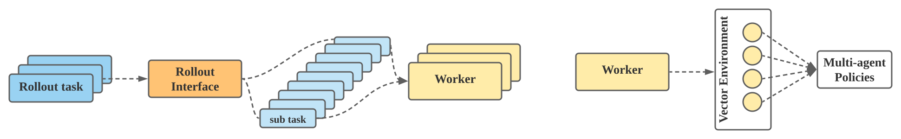

.. _quick-start:

Quick Start
===========
If you have not installed MALib yet, please refer to :ref:`installation` before running. The following content will give a brief introduction to the key components in MALib, company with two cases of running `Policy Space Response Oracle (PSRO) <https://arxiv.org/pdf/1711.00832.pdf>`_ for `Leduc Holdem <https://en.wikipedia.org/wiki/Texas_hold_%27em>`_, and `MADDPG <https://arxiv.org/abs/1706.02275>`_ for a particle multi-agent cooperative task, `Simple Spread <https://www.pettingzoo.ml/mpe/simple_spread>`_.

Training Agent Interfaces
-------------------------
`Training agent interface <>`_ is a core component in MALib, which integrates policy pool management and training task execution. Typically, a training interface is responsible for the policy learning of multiple agents. Users can specify the relationship using `training agent mapping <>`_ to determine agent management in training interfaces.

.. figure:: ../imgs/training_agent_interface.svg
    :align: center

The training interface supports heterogeneous policy mappings. As illustrated above, agents can share policies with others or have independently ownership of policies. Here we list the instantiation of training interface using getter method ``get_training_agent``

.. code-block:: python

    training_interface = get_training_agent(type="async")(
        env_desc=env_description,
        training_agent_mapping=lambda agent: agent,
        algorithm_candidates=algorithms,
        observation_spaces=observation_spaces,
        action_spaces=action_spaces
    )

or you can provide training interface configuration to the standard runner interface as below

.. code-block:: python

    from malib import runner

    runner.run(
        # ...
        training={
            "interface": {
                "type": "independent",
                # ...
            }
        }
        # ...
    )

To get more details, you can move to `Training Agent Interfaces <>`_.

Rollout Interfaces
------------------
In MALib, rollout tasks are decoupled from learning tasks to achieve high tolerance of parallel performant. A typical `Rollout interface <>`_ is nested with workers work in parallel. The coming rollout tasks will be decomposed into sub-tasks and dispatched to the workers. To keep consistency with latest policy version, the rollout interface will coordinate with remote `parameter server <>`_ to pull parameters.

As the rollout tasks are dispatched to workers, they will be executed in `vector enviroments <>`_ or `sequential environments <>`_. The instantiation is similar to the training interface. For example, you can create an instance explicitly using getter method ``get_rollout_interface``

.. code-block:: python

    rollout_interface = get_rollout_interface(type="async")(
        env_desc=env_desc,
        metric_type="simple"
    )

or provide a ``rollout configuration`` to the standard runner interface as below

.. code-block:: python

    from malib import runner

    runner.run(
        # ...
        rollout={
            "type": "async",
            "callback": "sequential"
        }
        # ...
    )

Algorithm: Policy, Trainer and Loss Function
--------------------------------------------
MALib decouples one algorithm into three components, i.e. `Policy <>`_, `Trainer <>`_ and `Loss Function <>`_ (optional). In a nutshell, Policy defines how an agent act in an environment, Trainer defines the optimization workflow, and Loss Function defines the loss function. Such a decomposition have some advantages\:

* `high code reuse for different policies`
* `lower maintenance for algorithm development`
* `single agent algorithm can be easily extended to multi-agent case`

For example, we can replace a single-agent trainer with a centralized trainer to reuse DQN in QMIX, DDPG in MADDPG.

Global Evaluator
----------------
`Global evaluator <>`_ bridges the evaluation results from rollout and training interfaces at each learning iteration and determine whether it is necessary to generate new learning iteration. Note that the learning iteration is defined in terms of policy expansion; each iteration of learning means one policy expansion.  More details could be found in `Actor-Evaluator-Learner model <>`_.

Examples
--------
Two examples are presented here, more cases could be found in our `Github repository <https://github.com/sjtu-marl/malib>`_. The listed examples are implemented using standard runner interface, which relies on a global settings. Users can read `Global Settings <https://github.com/sjtu-marl/malib/blob/main/malib/settings.py>`_ to get a full knowledge of its fields and initialization.

PSRO Learning
^^^^^^^^^^^^^

**Policy Space Response Oracle (PSRO)** is a population-based MARL algorithm which cooperates game-theory and MARL algorithm to solve multi-agent tasks in the scope of meta-game. At each iteration, the algorithm will generate some policy combinations and executes independent learning for each agent. Such a nested learning process comprises rollout, training, evaluation in sequence, and works circularly until the algorithm finds the estimated Nash Equilibrium. 

.. note:: If you want to use alpha\-rank to estimate the equilibrium, you need to install open\-spiel before that. Follow the :ref:`installation` to get more details.

**Specify the environment**: The first thing is to determine whhich environment you want to use. Here, we select the Leduc Hodlem environment as an example. If you want to apply custom environments to this case, please refer to the :ref:`api-environment-custom` to get more details.

.. note:: Currently, to use this poker environment, you need to install open-spiel firstly. Follow the :ref:`installation` to get more details.

.. code-block:: python

    from malib.envs.poker import poker_aec_env as leduc_holdem

    env = leduc_holdem.env(fixed_player=True)
    env_description = {
        "creator": leduc_holdem.env,
        "config": {"fixed_player": True},
        "id": "leduc_holdem",
        "possible_agents": env.possible_agents
    }

**Specify the training interface**: `Independent training interface <>`_ is designed to support independent learning such as DQN and PPO. As for the agent management, one interface for one agent. Since PSRO is nested with single-agent reinforcement learning algorithm, we choose independent training interface here to support the policy training.

.. code-block:: python

    training={
        "interface": {
            "type": "independent",
            "observation_spaces": env.observation_spaces,
            "action_spaces": env.action_spaces
        },
    },

**Specify the rollout interface**: Since independent training interface works in asynchronous mode, a rollout interface works asychronously is ideally in this case. Here, we choose `Async rollout interface <>`_ to meet this requirement.

.. code-block:: python

    from malib.rollout import rollout_func

    rollout = {
        "type": "async",
        "stopper": "simple_rollout",
        "callback": rollout_func.sequential
    }

**Specify the underlying (MA)RL algorithm**: PSRO requires an underlying RL algorithm to find the best response at each learning iteration. As a standard implementation, the underlying algorithm is PPO.

.. code-block:: python

    algorithms = {
        "PSRO_PPO": {
            "name": "PPO",
            "custom_config": {
                "gamma": 1.0,
                "eps_min": 0,
                "eps_max": 1.0,
                "eps_decay": 100,
            },
        }
    },

The completed distributed execution example is presented below.

.. code-block:: python

    """PSRO with PPO for Leduc Holdem"""

    from malib.envs.poker import poker_aec_env as leduc_holdem
    from malib.runner import run
    from malib.rollout import rollout_func

    env = leduc_holdem.env(fixed_player=True)

    run(
        agent_mapping_func=lambda agent_id: agent_id,
        env_description={
            "creator": leduc_holdem.env,
            "config": {"fixed_player": True},
            "id": "leduc_holdem",
            "possible_agents": env.possible_agents,
        },
        training={
            "interface": {
                "type": "independent",
                "observation_spaces": env.observation_spaces,
                "action_spaces": env.action_spaces
            },
        },
        algorithms={
            "PSRO_PPO": {
                "name": "PPO",
                "custom_config": {
                    "gamma": 1.0,
                    "eps_min": 0,
                    "eps_max": 1.0,
                    "eps_decay": 100,
                },
            }
        },
        rollout={
            "type": "async",
            "stopper": "simple_rollout",
            "callback": rollout_func.sequential
        }
    )

Multi-agent Reinforcement Learning
^^^^^^^^^^^^^^^^^^^^^^^^^^^^^^^^^^

coming soon ...